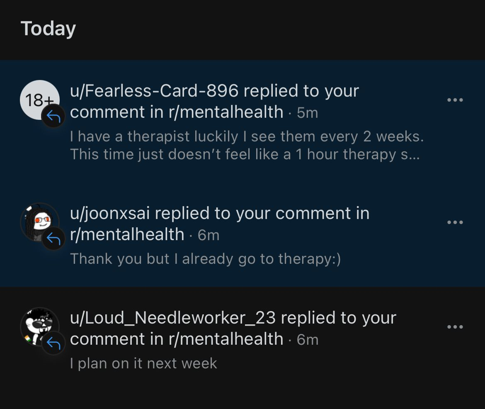

# Depression Detection using Transformers
---

This project is a Reddit bot that detects potential signs of depression in posts on a subreddit, using an NLP model for classification. The bot monitors subreddit posts and flags posts that may contain indicators of depressive language.


## File Descriptions
**src/__init__.py**
- Initializes the src package and imports core functions for easy access. Also sets up logging and any constants.

**src/config.py**
- Stores Reddit API credentials (client_id, client_secret, user_agent, username, password). Be careful not to share this file publicly, as it contains sensitive information.

**src/main.py** 
- The main script to run the bot. It initializes a Reddit connection using the praw library, loads the NLP model, fetches posts, and detects signs of depression in titles and content using detect_depression from nlp_model.py.

**src/nlp_model.py**
- Defines the detect_depression function, which uses a pre-trained NLP model to classify text as containing signs of depression or not.

**requirements.txt**
- Lists all Python libraries required by the project

**logs/bot.log**
- Stores logs of the bot’s activities, including errors and other events. Useful for troubleshooting.

## How to run the code

1) Create a virtual environment to ensure that there are no dependency conflicts
```
python m -venv venv
```

```
venv\Scripts\activate
```

2) Install necessary dependencies 
```
pip install -r requirements.txt
```

3) Configure the Reddit API Credentials in config.py

Generate your credentials from [here](https://www.reddit.com/prefs/apps). Any additional errors can be solved by referering to [this](https://praw.readthedocs.io/en/stable/getting_started/authentication.html)

The code snippet shown below can be used directly in the config.py, there is no need to create a .env file and use it. The .env file was used only for privacy reasons

```
client_id = 'YOUR_CLIENT_ID'
client_secret = 'YOUR_CLIENT_SECRET'
user_agent = 'DepressionDetectionBot/1.0 by YOUR_USERNAME'
username = 'YOUR_REDDIT_USERNAME'
password = 'YOUR_REDDIT_PASSWORD'
```

4) Run the bot 

```
python src\main.py
```

The bot will begin monitoring posts on the specified subreddit and log any flagged posts with potential indicators of depression

----

Below is a snippet of the message my bot sent to various accounts 

> "Hello! This message is being sent by a bot. If you're feeling down, please consider reaching out to a mental health professional. You’re not alone!"


